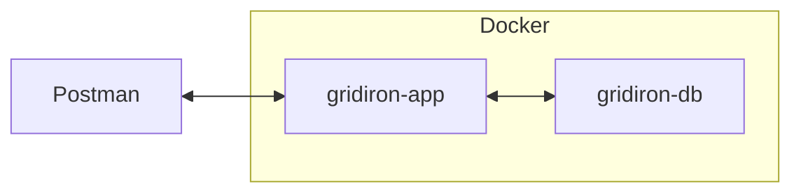
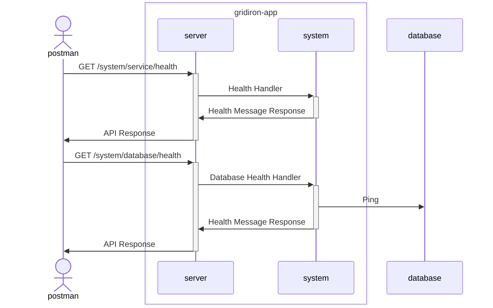
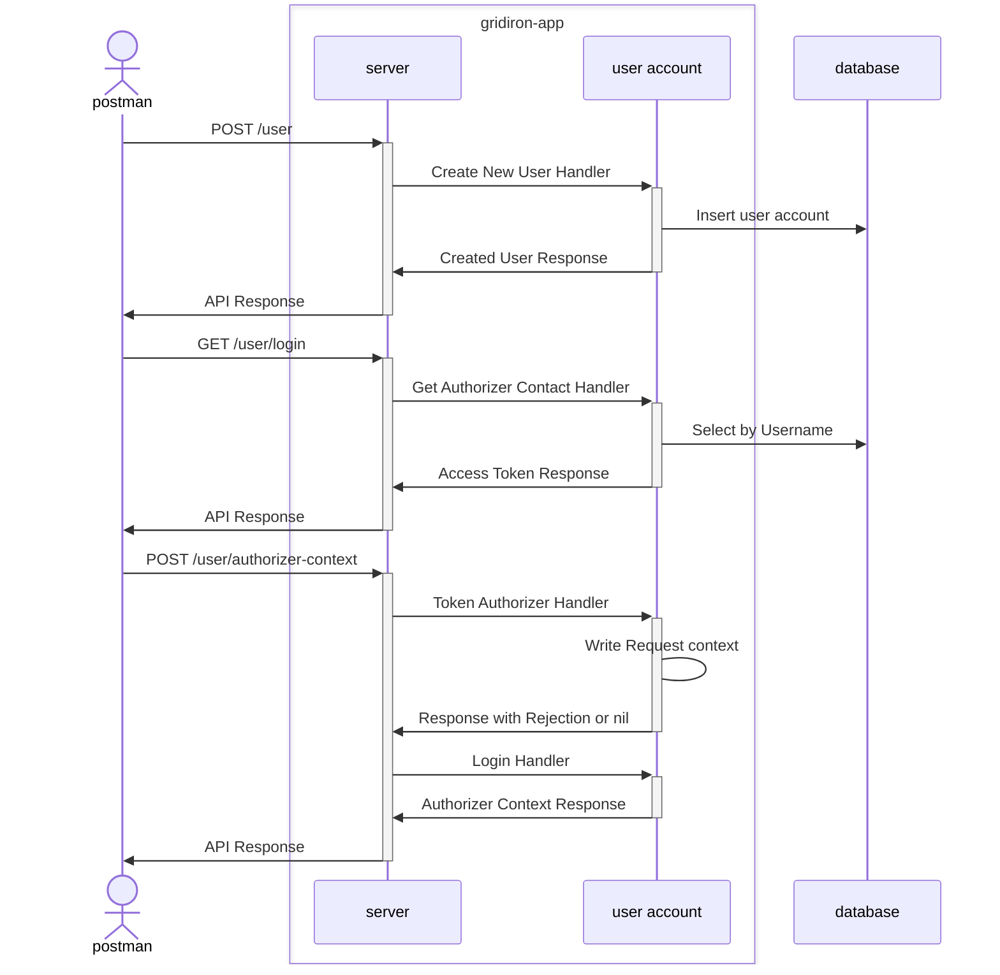
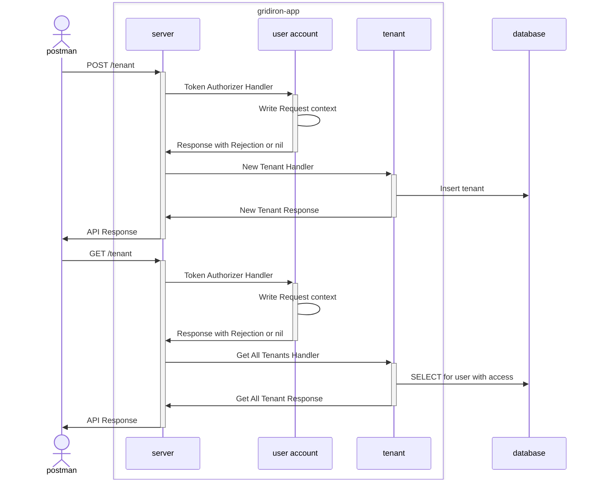

# Technical Design

- [Project Structure](#project-structure)
- [APIs](#apis)
- [Environment](#environment)
- [System](#system)
    - [Contracts](#system-contracts)
    - [Sequence Diagrams](#system-sequence-diagram)
- [User Account](#user-account)
    - [Contracts](#user-contracts)
    - [Sequence Diagrams](#user-sequence-diagram)
- [Tenant](#tenant)
    - [Contracts](#tenant-contracts)
    - [Sequence Diagrams](#tenant-sequence-diagram)
- [External Dependencies](#external-dependencies)


## Project Structure

Gridiron follows the [Project Layout](https://github.com/golang-standards/project-layout) specified by the golang standards.

* main.go should be placed at `./cmd/gridiron/gridiron.go`
    * Files are instead at root.
    * During initial development, there were problems getting things working. Instead of investing the time in this small item, I chose to move it to the root dir and move forward with the project.

## Environment


## System
```go
package system
```

* GET `/system/service/health`
    * Request N/A
    * Response
        
        On success: 200
        ```json
        {
          "message": "Gridiron Service is Healthy",
          "timestamp": "<time.Now().UTC().Format(time.RFC3339)>"
        }
        ```

        On Failure: 500
        ```json
        {
          "message": "Internal Server Error.",
          "timestamp": "<time.Now().UTC().Format(time.RFC3339)>"
        }
        ```

* GET `/system/database/health`
    * Request N/A
    * Response
        
        On success: 200
        ```json
        {
          "message": "Gridiron has a healthy connection to the database.",
          "timestamp": "<time.Now().UTC().Format(time.RFC3339)>"
        }
        ```

        On Failure: 500
        ```json
        {
          "message": "Internal Server Error.",
          "timestamp": "<time.Now().UTC().Format(time.RFC3339)>"
        }
        ```

### System Contracts

* Health Message
    ```json
    {
        "message": "",
        "timestamp": "<time.RFC3339 as string>"
    }
    ```

### System Sequence Diagram



## User Account
```go
package useracc
```

* POST `/user`
    * Request

        ```json
        {
          "username": "",
          "password": ""
        }
        ```

    * Response
        
        On success: 200
        ```json
        {
          "id": "uuid",
          "username": ""
        }
        ```

        On success: 400
        ```json
        {
          "message": "Username is taken.",
          "timestamp": "<time.Now().UTC().Format(time.RFC3339)>"
        }
        ```

        On Failure: 500
        ```json
        {
          "message": "Internal Server Error.",
          "timestamp": "<time.Now().UTC().Format(time.RFC3339)>"
        }
        ```

* GET `/user/authorizer-context`
    * Request N/A
    * Response
        
        On success: 200
        ```json
        {
          "id": "uuid",
        }
        ```

        On Failure: 500
        ```json
        {
          "message": "Internal Server Error.",
          "timestamp": "<time.Now().UTC().Format(time.RFC3339)>"
        }
        ```

* POST `/user/login`
    * Request

        ```json
        {
          "username": "",
          "password": ""
        }
        ```

    * Response
        
        On success: 200
        ```json
        {
          "access_token": ""
        }
        ```

        On Failure: 400
        ```json
        {
          "message": "Invalid username or password.",
          "timestamp": "<time.Now().UTC().Format(time.RFC3339)>"
        }
        ```

        On Failure: 500
        ```json
        {
          "message": "Internal Server Error.",
          "timestamp": "<time.Now().UTC().Format(time.RFC3339)>"
        }
        ```

### User Contracts

* Created User DTO
    ```json
    {
        "id": "",
        "username": ""
    }
    ```
  
* User Pass DTO
    ```json
    {
        "username": "",
        "password": ""
    }
    ```

### User Sequence Diagram



## Tenant
```go
package tenant
```

* POST `/tenant/{name}`
    * Request N/A
    * Response
        
        On success: 200
        ```json
        {
          "id": "uuid",
          "name": ""
        }
        ```

        On Failure: 500
        ```json
        {
          "message": "Internal Server Error.",
          "timestamp": "<time.Now().UTC().Format(time.RFC3339)>"
        }
        ```

* GET `/tenant`
    * Request N/A
    * Response
        
        On success: 200
        ```json
        {
          "count": 1,
          "data": [
            {
              "id": "uuid",
              "name": ""
            }
          ]
        }
        ```

        On Failure: 500
        ```json
        {
          "message": "Internal Server Error.",
          "timestamp": "<time.Now().UTC().Format(time.RFC3339)>"
        }
        ```

## Tenant Contracts

* Tenant
    ```json
    {
        "id": "",
        "name": ""
    }
    ```

* Tenant User Access
    ```json
    {
        "tenant_id": "",
        "user_account_id": "",
        "access_level": "OWNER"
    }
    ```

### Tenant Sequence Diagram



## External Dependencies

| Name | Version | License | Purpose |
| --- | --- | --- | --- |
| [github.com/golang-jwt/jwt](https://github.com/golang-jwt/jwt) | v3.2.2+incompatible | [MIT License](https://github.com/golang-jwt/jwt/blob/main/LICENSE) | JSON Web Token implementation for Go. |
| [github.com/google/uuid](https://github.com/google/uuid) | v1.6.0 | [BSD 3-Clause "New" or "Revised" License](https://github.com/google/uuid/blob/master/LICENSE) | Implementation of Universally Unique Identifier (UUID) in Go. |
| [github.com/gorilla/mux](https://github.com/gorilla/mux) | v1.8.1 | [BSD 3-Clause "New" or "Revised" License](https://github.com/gorilla/mux/blob/main/LICENSE) | Implements a request router and dispatcher for matching incoming requests to their respective handler. | 
| [github.com/joho/godotenv](https://github.com/joho/godotenv) | v1.5.1 | - | Loads environment variables from a `.env` file into the process's environment. |
| [github.com/lib/pq](https://github.com/lib/pq) | v1.10.9 | [MIT License](https://github.com/lib/pq/blob/master/LICENSE.md) | A pure Go PostgreSQL driver for Go's database/sql package. | 
| [github.com/stretchr/testify](https://github.com/stretchr/testify) | v1.9.0 | [MIT License](https://github.com/stretchr/testify/blob/master/LICENSE) | Tools for asserting that your code will behave as you intend during testing. |
| [go.uber.org/zap](https://github.com/uber-go/zap) | v1.27.0 | [MIT License](https://github.com/uber-go/zap/blob/master/LICENSE) | Logger developed by Uber.  |
| [golang.org/x/crypto](https://github.com/golang/crypto) | v0.21.0 | [BSD 3-Clause "New" or "Revised" License](https://github.com/golang/crypto/blob/master/LICENSE) | Additional cryptography package for hashing passwords |
