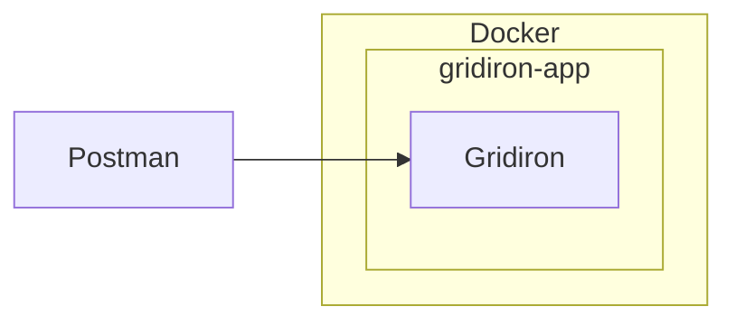
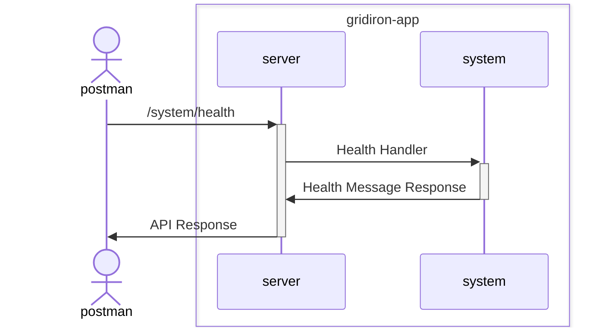

# Technical Design

## Project Structure

Gridiron follows the [Project Layout](https://github.com/golang-standards/project-layout) specified by the golang standards.

### Flaws in Design
* Dockerfile should be placed at `./build` and main.go should be placed at `./cmd/gridiron/gridiron.go`
    * Files are instead at root.
    * During initial development, there were problems getting things working. Instead of investing the time in this small item, I chose to move it to the root dir and move forward with the project.

## Environment


## System

### Contracts

* Health Message
    ```json
    {
        "message": "",
        "timestamp": "<time.RFC3339 as string>"
    }
    ```

### Sequence Diagram



### External Dependencies

| Name | Version | License | Purpose
| --- | --- | --- | --- |
| [github.com/gorilla/mux](https://github.com/gorilla/mux) | v1.8.1 | [BSD 3-Clause "New" or "Revised" License](https://github.com/gorilla/mux/blob/main/LICENSE) | Implements a request router and dispatcher for matching incoming requests to their respective handler. | 
| [github.com/stretchr/testify](https://github.com/stretchr/testify) | v1.9.0 | [MIT License](https://github.com/stretchr/testify/blob/master/LICENSE) |  Tools for testifying that your code will behave as you intend. |
| [go.uber.org/zap](https://github.com/uber-go/zap) | v1.27.0 | [MIT License](https://github.com/uber-go/zap/blob/master/LICENSE) | Logger developed by Uber.  |
